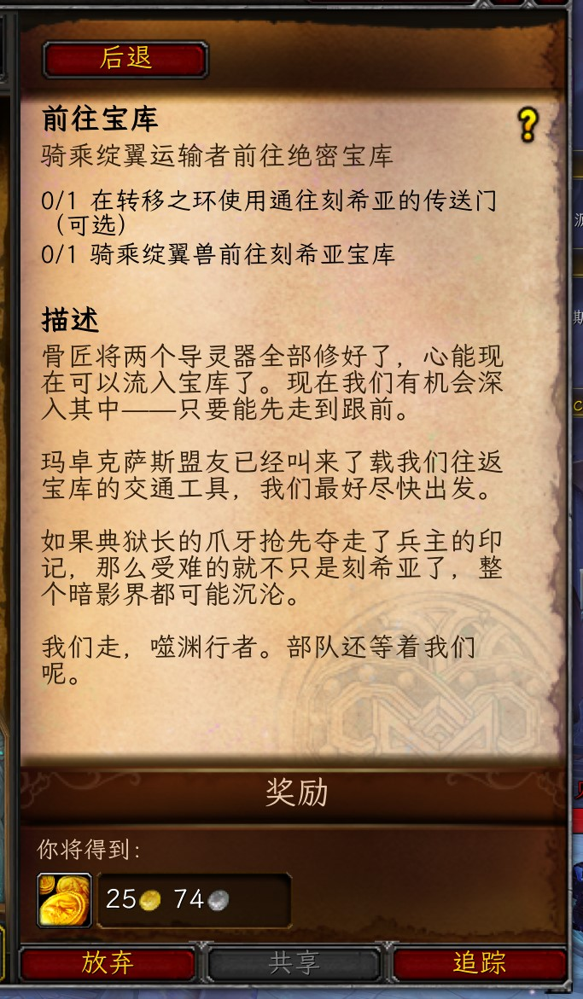
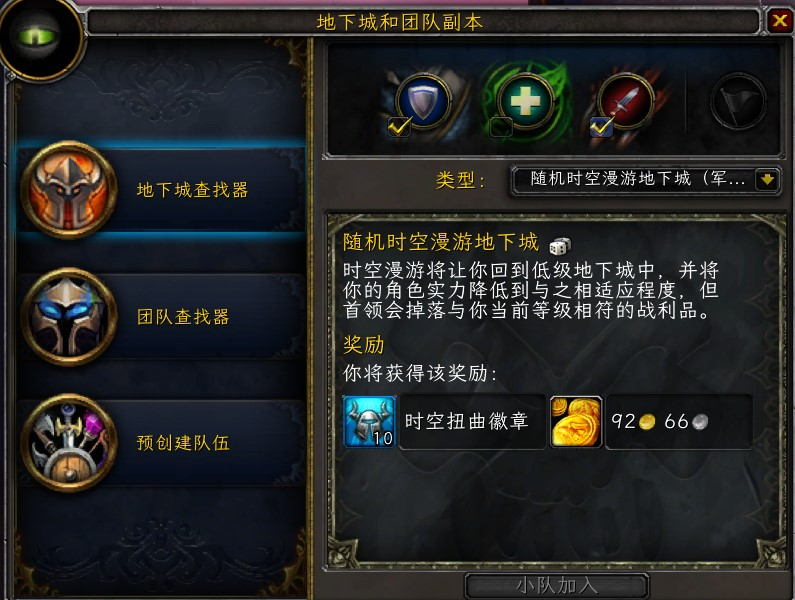

# ClearFont
## 简介

这是一个根据ClearFont早期台服插件代码修改而来。

强烈推荐使用：[lxgw/LxgwWenKai: An open-source Chinese font derived from Fontworks' Klee One. 一款开源中文字体，基于 FONTWORKS 出品字体 Klee One 衍生。 (github.com)](https://github.com/lxgw/LxgwWenKai) 作为魔兽世界的主要字体，该字体清晰，比原生客户端的字体要好看，并且适配也不突兀。

备注：目前发现怀旧服（巫妖王之怒）动作条API与正式服不一致，鉴于不想维护怀旧服，所以代码就暂时不增加动作条部分的内容了

例：

```lua
local function SetActionBarFontSize(size)
    for i = 1, 12 do
        local button = _G["ActionButton" .. i]
        if button then
            local hotkey = _G[button:GetName() .. "HotKey"]
            if hotkey then
                local font, _, flags = hotkey:GetFont()
                hotkey:SetFont(font, size, flags)
            end
        end
    end
end
SetActionBarFontSize(12)
```

## 字体预览





## 特性

1. 支持全局字体大小调整
2. 可选择Font文件夹内的字体，可增加额外字体应用在不同的UI组件内。
3. 修正了部分函数异常，可以支持10.0/11.0客户端。
4. 代码重新整合
